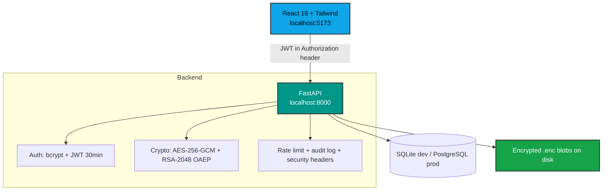

<div align="center">

# 🔐 Secure File Storage System
### Encrypted file storage where only you hold the keys

[](https://www.python.org/)
[](https://fastapi.tiangolo.com/)
[](https://react.dev/)
[](https://www.typescriptlang.org/)
[](https://opensource.org/licenses/MIT)


---

**Secure File Storage** is a full-stack web app for storing files no one else can read — not even the server operator. Every file gets its own random AES-256-GCM key, the key is sealed to your RSA public key, and only ciphertext ever touches the disk.

[Quick Start](#-quick-start) • [App Tour](#-app-tour) • [How It Works](#-how-it-works) • [Architecture](#-architecture) • [API Reference](API.md)

</div>

---

## ⚡ Quick Start

> [!NOTE]
> The default config uses SQLite and the local frontend origin, so the app runs out of the box — no database server needed. (Linux/macOS: swap `copy` → `cp` and `venv\Scripts\activate` → `source venv/bin/activate`.)

```powershell
# 1. Clone and enter the project
git clone https://github.com/Hriday-03/Secure-File-Storage.git
cd Secure-File-Storage

# 2. Backend — terminal 1
python -m venv venv
venv\Scripts\activate
cd backend
pip install -r requirements.txt
copy .env.example .env
alembic upgrade head
uvicorn app.main:app --reload
# → API at http://localhost:8000  (interactive docs at /docs)

# 3. Frontend — new terminal, from the repo root
cd frontend
npm install
npm run dev
# → App at http://localhost:5173
```

> [!TIP]
> Register a fresh account in the app, or sign in with the dev account `test@example.com` / `securepass123`.

---

## 🖱️ App Tour

Follow a file through the app in four steps:

### Step 1 — Create your account
Register with a name, email, and password. The server generates your personal **RSA-2048 keypair**, encrypts the private key with a master key, and hands you a **JWT** valid for 30 minutes. No email verification, no friction.

### Step 2 — Meet your dashboard

Total files, encrypted storage used, last upload, and the active cipher — one glance tells you the state of your vault.

### Step 3 — Upload files

Drag & drop (or browse) with live per-file progress. Each upload gets a **fresh random AES-256 key**, is encrypted in 1 MiB chunks, and executables (`.exe`, `.bat`, `.sh`, `.js`, …) plus files over 100 MB are rejected before touching storage.

### Step 4 — Manage and download

Search by filename, sort by name/size/date, page through results, rename, delete — or download, which streams the file back decrypted byte-for-byte.

---

## 🔍 Key Capabilities

<div align="center">

| Feature | Description | Icon |
| :--- | :--- | :---: |
| **Per-File Encryption** | Fresh random AES-256-GCM key for every upload, chunked 1 MiB streaming. | 🔐 |
| **RSA Key Management** | RSA-2048 OAEP-SHA-256 seals each file key; private keys encrypted at rest (HKDF). | 🔑 |
| **JWT Authentication** | 30-minute tokens, bcrypt-hashed passwords (72-byte limit enforced). | 🎫 |
| **Upload Guardrails** | Extension allowlist + executable blocklist, empty-file and 100 MB size checks. | 🛡️ |
| **Search, Sort, Paginate** | Case-insensitive filename search with name/size/date sorting. | 🔍 |
| **Streaming Downloads** | Decrypt-on-the-fly delivery — constant memory even for large files. | 📥 |
| **Profile Management** | Update display name, change password with current-password verification. | 👤 |
| **Rate Limiting** | 10/min on auth endpoints, 120/min elsewhere, with `Retry-After`. | 🚦 |
| **Audit Logging** | Every request logged with method, path, status, duration, and user. | 📋 |
| **Resilient UI** | Error boundary, 404 page, toasts, and code-split routes. | ✨ |

</div>

---

## ⚙️ How It Works

Each file passes through four cryptographic stages:

<div align="center">

| Stage | Operation | Detail |
| :--- | :--- | :--- |
| **1. Encrypt** | `AES-256-GCM` | Fresh 256-bit key per file; 1 MiB chunks framed as `[len ‖ nonce ‖ ct+tag]` |
| **2. Wrap key** | `RSA-2048 OAEP-SHA-256` | File key sealed to the owner's public key (32 bytes — well under the 190 B limit) |
| **3. Store** | `Ciphertext only` | `.enc` blob on disk + metadata in DB; stored names and sealed keys never exposed via API |
| **4. Decrypt** | `Streamed` | Private key recovered → AES key unwrapped → bytes decrypted chunk-by-chunk on download |

</div>

---

## 🏗️ Architecture



---

## 📊 File Lifecycle

```
1. REGISTER        → RSA-2048 keypair generated, private key HKDF-encrypted at rest
2. LOGIN           → bcrypt verified, JWT issued (30 min)
3. UPLOAD          → Sanitized + validated → fresh AES key → chunked GCM encrypt → RSA-wrapped key
4. LIST            → Paginated search/sort over metadata (composite index on user + date)
5. DOWNLOAD        → Ownership check → unwrap key → streamed decrypt, byte-identical return
6. RENAME / DELETE → Metadata update, or blob + record removal
```

---

## 🧰 Tech Stack

- **Backend:** Python 3.11, FastAPI, SQLAlchemy 2, Alembic, Pydantic, Uvicorn
- **Frontend:** React 19, TypeScript, Vite, Tailwind CSS v4, React Router, Axios, TanStack Query
- **Database:** SQLite (dev) / PostgreSQL (prod)
- **Cryptography:** `cryptography` (AES-GCM, RSA-OAEP), `bcrypt`, `python-jose` (JWT)
- **Testing:** pytest — 33 tests (16 crypto + 17 API), 92% coverage
- **Deploy:** Docker + Compose, nginx (SPA + `/api` reverse proxy)

---

## 📁 Repository Overview

```ascii
Secure-File-Storage/
├── backend/
│   ├── app/              # api · core · crypto · database · middleware · services
│   ├── migrations/       # Alembic revisions (schema + RSA keys + file index)
│   ├── tests/            # conftest + test_crypto + test_api
│   ├── requirements.txt
│   └── .env.example
├── frontend/
│   ├── src/              # pages · components · services · context
│   ├── nginx.conf        # prod reverse proxy (/api → backend)
│   └── package.json
├── Images/               # screenshots used in this README
├── docker-compose.yml    # backend + frontend + shared volume
├── API.md                # full endpoint + error-code reference
└── README.md             # this file
```

---

## 🐳 Docker Deployment

```powershell
# Build and run both services (frontend → http://localhost:8080)
docker compose up --build
```

> [!WARNING]
> - Set a strong `SECRET_KEY` in `backend/.env` before deploying — the default is a placeholder.
> - Point `DATABASE_URL` at PostgreSQL for production; SQLite lives in the shared volume.
> - If you serve the frontend from a non-localhost origin, add it to `CORS_ORIGINS`.

---

## 🚨 Important Notes

> [!CAUTION]
> - **Back up `SECRET_KEY`.** Private keys are encrypted with a master key derived from it — rotating or losing it makes every stored file permanently unreadable.
> - **Never commit `backend/.env`** — it holds `SECRET_KEY` (already gitignored).

> [!NOTE]
> - Uploads are capped at 100 MB (`MAX_UPLOAD_SIZE_MB`); executables and scripts are blocked by extension.
> - Auth endpoints are rate-limited to 10 requests/min per IP — hammering login in tests will return `429`.

---

## 🧪 Testing

```powershell
cd backend
python -m pytest            # 33 tests
python -m pytest --cov=app  # coverage report (~92%)
```

---

<div align="center">

**Your files. Your keys. Nobody else's business.**

*Built with FastAPI, React, and modern cryptography — all 17 build phases complete.*

[](https://opensource.org/licenses/MIT)
[](backend/tests)

</div>
