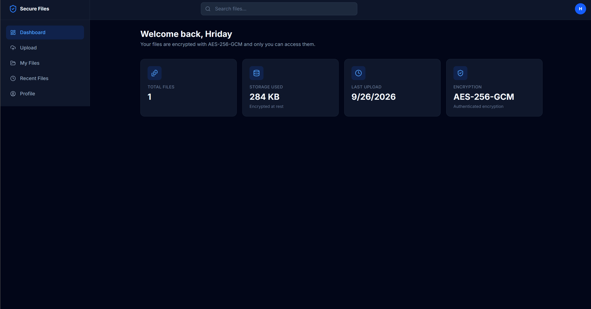
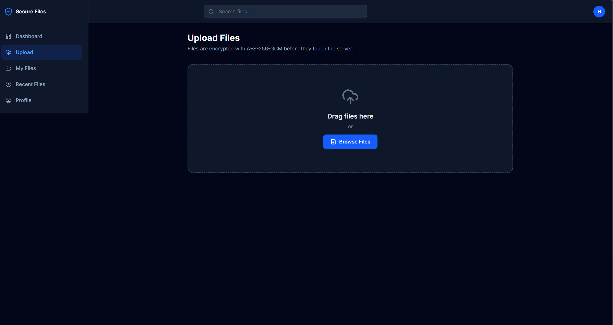
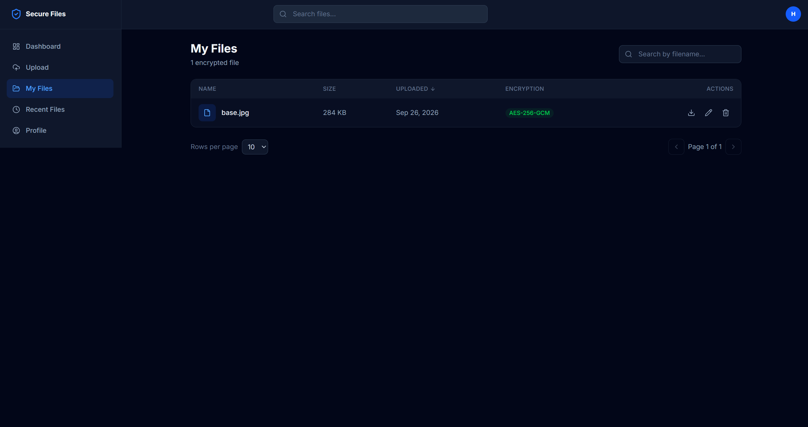

<div align="center">

# 🔐 Secure File Storage System

**Store your files encrypted. Only you hold the keys.**

[](https://www.python.org/)
[](https://fastapi.tiangolo.com/)
[](https://react.dev/)
[](https://www.typescriptlang.org/)
[](https://en.wikipedia.org/wiki/Galois/Counter_Mode)
[](backend/tests)
[](LICENSE)

A secure, modern, full-stack web application for storing encrypted files using industry-standard cryptography. Files are encrypted with **AES-256-GCM** before storage, while **RSA-2048** is used for secure key management. Only authenticated users can access and decrypt their own files.

[Getting Started](#-getting-started) · [API Reference](API.md) · [Screenshots](#-screenshots)

</div>

---

## 📸 Screenshots

### Dashboard


### Upload


### My Files


---

## ✨ Features

### Authentication
- User Registration
- User Login
- JWT Authentication
- Password Hashing (bcrypt/Argon2)
- Protected Routes
- Session Management

### Secure File Storage
- Secure File Upload
- AES-256-GCM File Encryption
- RSA Key Encryption
- Secure File Download
- Delete Files
- Search Files
- Pagination
- File Metadata Management

### Security
- JWT Authentication
- Password Hashing
- File Ownership Verification
- HTTPS Ready
- SQL Injection Protection
- XSS Protection
- Input Validation
- Secure File Handling

### User Interface
- Modern Dashboard
- Drag & Drop Upload
- Responsive Design
- Dark / Light Theme
- Toast Notifications
- Upload Progress
- Search & Filter
- File Management

---

# 🏗 Architecture

```
React (Frontend)
        │
        │ HTTPS + JWT
        ▼
FastAPI Backend
        │
 ┌──────┴─────────┐
 │                │
 ▼                ▼
PostgreSQL   Encrypted Storage
               (Disk / S3)
```

---

# 🛠 Tech Stack

## Frontend

- React
- TypeScript
- Vite
- Tailwind CSS
- React Router
- Axios
- TanStack Query

## Backend

- Python 3.12+
- FastAPI
- SQLAlchemy
- Alembic
- Pydantic
- Uvicorn

## Database

- PostgreSQL
- SQLite (Development)

## Cryptography

- cryptography
- bcrypt
- python-jose

---

# 📁 Project Structure

```
secure-file-storage/
│
├── backend/
│   ├── app/              # FastAPI app (api, core, crypto, database, services)
│   ├── migrations/       # Alembic migrations
│   ├── tests/            # pytest suite (33 tests)
│   ├── requirements.txt
│   └── .env.example
│
├── frontend/
│   ├── src/              # React + TypeScript + Tailwind
│   ├── nginx.conf        # Production reverse proxy
│   └── package.json
│
├── Images/               # App screenshots
│
├── docker-compose.yml
├── API.md                # Full API reference
├── README.md
└── .gitignore
```

---

# 🚀 Getting Started

## 1. Clone Repository

```bash
git clone https://github.com/Hriday-03/Secure-File-Storage.git

cd Secure-File-Storage
```

---

## 2. Backend Setup

Create a virtual environment at the repository root

```bash
python -m venv venv
```

Activate

Windows

```bash
venv\Scripts\activate
```

Linux / macOS

```bash
source venv/bin/activate
```

Install dependencies and configure the environment

```bash
cd backend
pip install -r requirements.txt
copy .env.example .env        # Windows
cp .env.example .env          # Linux / macOS
```

> The default `.env` uses SQLite (`secure_storage.db`) and the local frontend origin
> `http://localhost:5173`, so it works out of the box. For production, change
> `DATABASE_URL` to PostgreSQL and set a strong `SECRET_KEY`.

Run migrations

```bash
alembic upgrade head
```

Run backend

```bash
uvicorn app.main:app --reload
```

Backend URL

```
http://localhost:8000
```

Swagger Documentation

```
http://localhost:8000/docs
```

---

## 3. Frontend Setup

Open a second terminal at the repository root and run:

```bash
cd frontend

npm install

npm run dev
```

Frontend

```
http://localhost:5173
```

The dev server proxies `/api` requests to the backend at `http://127.0.0.1:8000` automatically.

---

## 4. First Login

Register an account from the app (or use the dev test accounts seeded in a local database:
`test@example.com` / `securepass123`). Files must have an allowed extension
(`txt`, `pdf`, `png`, `jpg`, `zip`, …); executables (`exe`, `bat`, `sh`, `js`) are blocked.
Upload limit is 100 MB.

---

# 🐳 Docker Deployment

Build and run both services with Compose (frontend on `http://localhost:8080`, backend on port 8000 inside the network):

```bash
docker compose up --build
```

- Backend image runs `alembic upgrade head` before starting uvicorn.
- Encrypted blobs, SQLite database, and logs persist in the `storage_data` volume.
- Nginx serves the built frontend, proxies `/api` to the backend, and limits uploads to 100 MB.
- Set `SECRET_KEY` (and a real `DATABASE_URL` if using PostgreSQL) in `backend/.env` before deploying.

---

# 🔒 Encryption Workflow

```
User Upload
      │
      ▼
Generate AES Key
      │
      ▼
Encrypt File (AES-256-GCM)
      │
      ▼
Encrypt AES Key (RSA)
      │
      ▼
Store Encrypted File
      │
      ▼
Save Metadata
```

Download

```
Retrieve File
      │
      ▼
Decrypt AES Key
      │
      ▼
Decrypt File
      │
      ▼
Return Original File
```

---

# 📚 API Endpoints

## Authentication

```
POST   /api/auth/register

POST   /api/auth/login

POST   /api/auth/logout

GET    /api/auth/me
```

## Files

```
POST   /api/files/upload

GET    /api/files

GET    /api/files/{id}

GET    /api/files/{id}/download

DELETE /api/files/{id}

PUT    /api/files/{id}/rename
```

## User

```
GET    /api/users/profile

PUT    /api/users/profile

POST   /api/users/change-password
```

## Dashboard

```
GET    /api/dashboard/stats
```

---

Full request/response contracts, error codes, and hardening details are in **[API.md](API.md)**.

---

# 🔐 Security Features

- AES-256-GCM Encryption (chunked streaming, 1 MiB chunks)
- RSA-2048 key pairs with OAEP-SHA-256
- Private keys encrypted at rest (HKDF master key from SECRET_KEY)
- bcrypt password hashing
- JWT Authentication (30 min expiry)
- File Ownership Verification
- Rate Limiting (auth 10/min, general 120/min)
- Security Headers (CSP, X-Frame-Options, nosniff, etc.)
- Filename Sanitization + path traversal protection
- Input Validation
- SQL Injection Protection (ORM)
- Error envelope that never leaks internals
- CORS pinned to configured origins

---

# 🧪 Testing

Run backend tests

```bash
cd backend
python -m pytest
```

Run with coverage

```bash
python -m pytest --cov=app
```

Current suite: 33 tests (16 crypto unit tests + 17 API integration tests), ~92% coverage.

---

# 📖 Documentation

- **[API.md](API.md)** — endpoint contracts, error codes, security details
- **[prd.md](prd.md)** — product requirements
- **[Architecture.md](Architecture.md)** — system architecture
- **[design.md](design.md)** — design decisions
- **[rules.md](rules.md)** — coding standards
- **[phases.md](phases.md)** — development phases
- **[memory.md](memory.md)** — build progress tracker

---

# 🚀 Future Features

- Two-Factor Authentication (2FA)
- Secure File Sharing
- Folder Management
- Version History
- Audit Logs
- Storage Analytics
- AWS S3 Integration
- Azure Blob Storage
- Malware Scanning
- File Expiration
- Activity Timeline
- Admin Dashboard

---

# 🤝 Contributing

1. Fork the repository.
2. Create a feature branch.
3. Follow the coding standards in `Rules.md`.
4. Write tests for new functionality.
5. Submit a pull request.

---

# 📄 License

This project is licensed under the MIT License.

---

# 👨‍💻 Author

Secure File Storage System

Built with ❤️ using FastAPI, React, and modern cryptography.